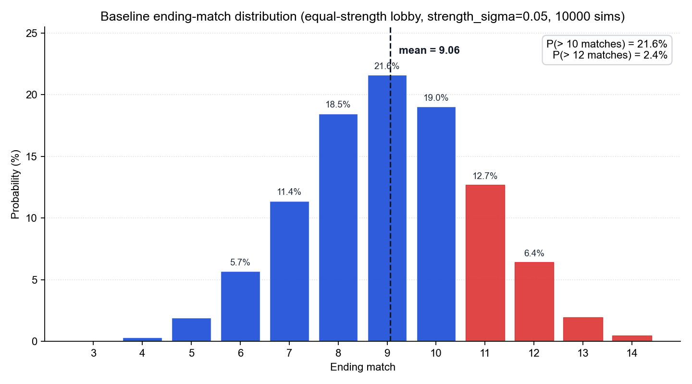
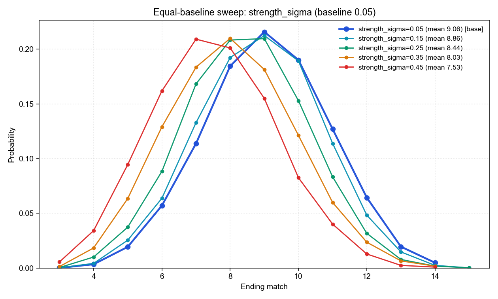
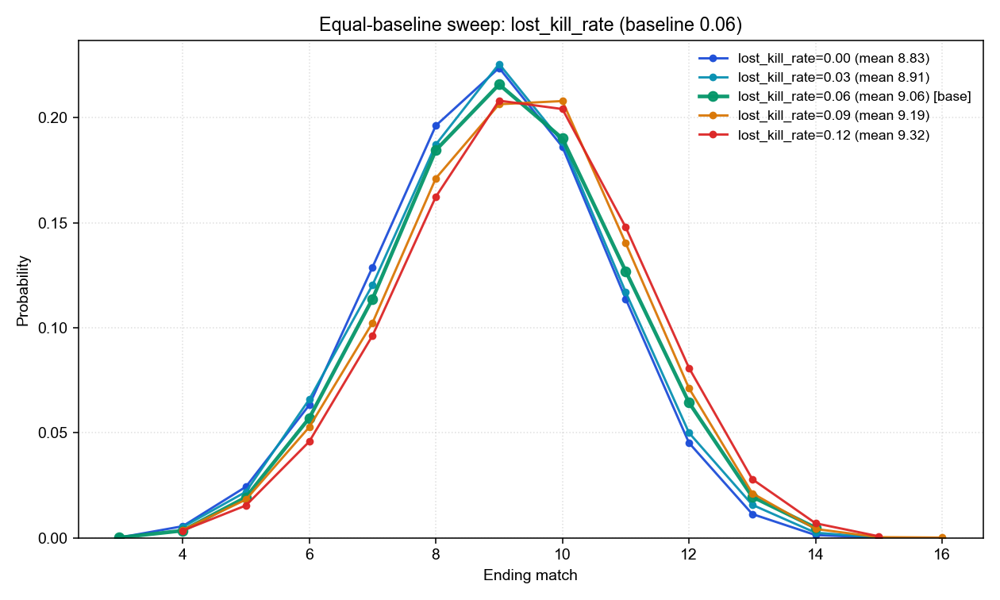
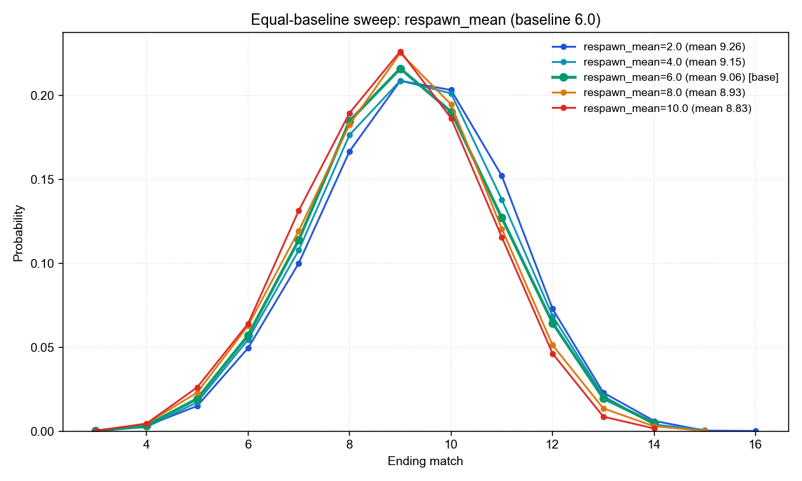
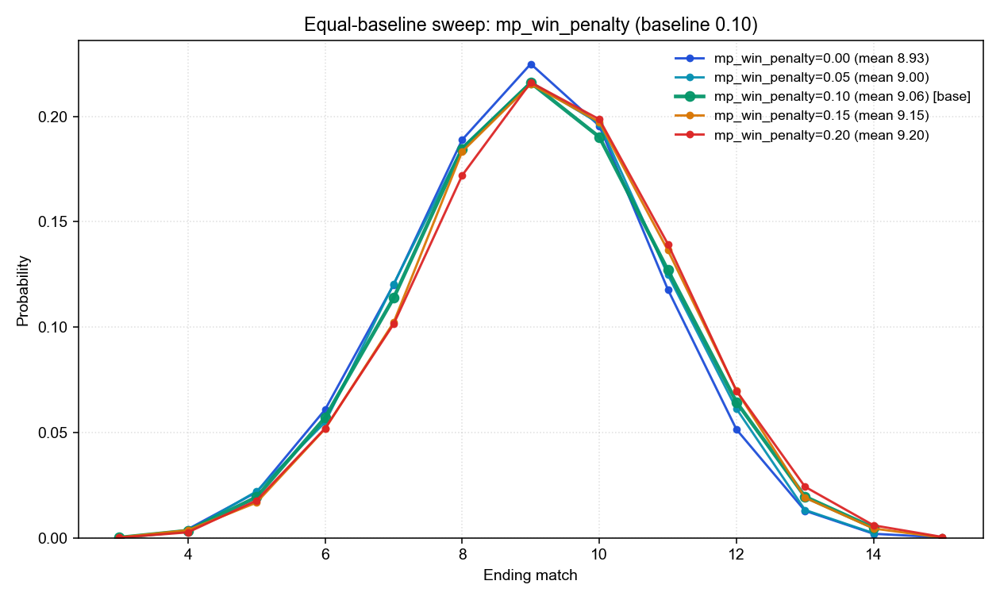
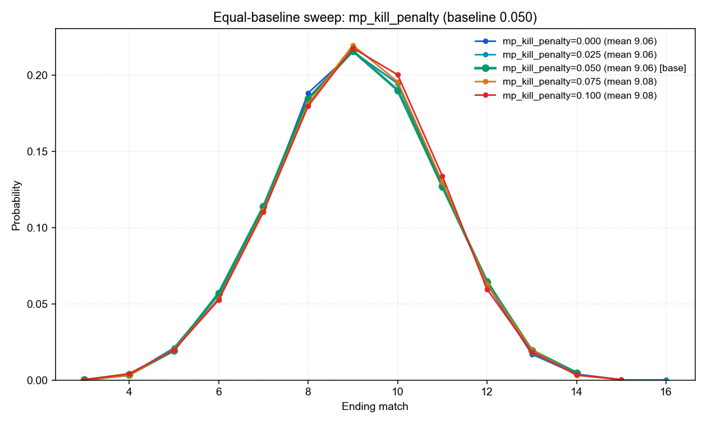
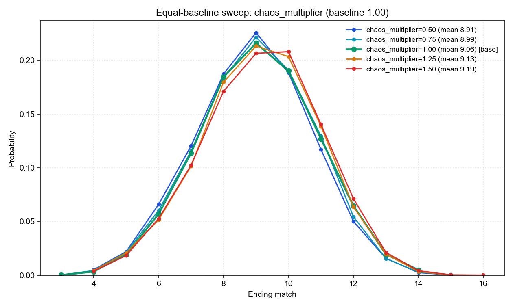
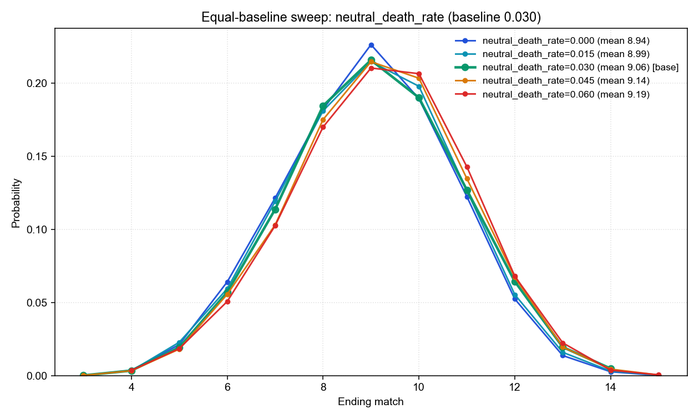
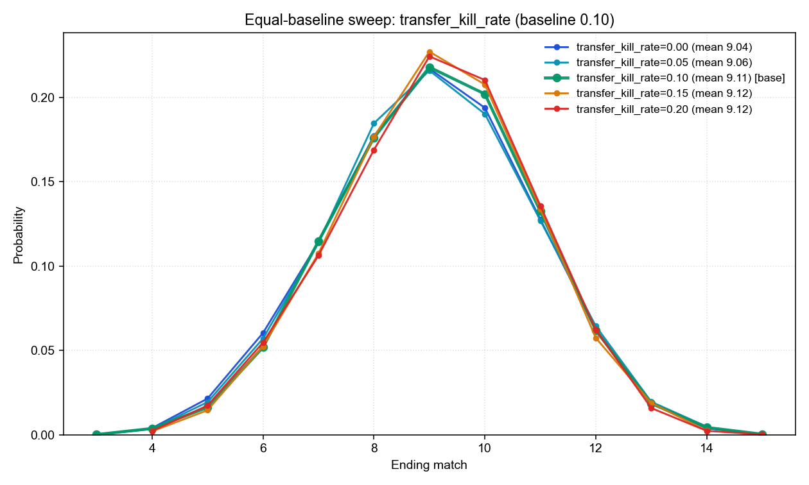

# 記事ドラフト: ALGS Match Point Finals の終了試合数を決めているもの

> 媒体想定: note / 個人ブログ。読者は ALGS をある程度見ている層 + シミュレーション/データ寄りの記事を読み慣れていない層にもリーチしたい。文体は常体。

---

## タイトル候補

ALGS Match Point Finals の大会が長引きやすくなる現象とその考察 — Monte Carlo シミュレーションによる検証

---

## リード (200 字)

私の案：
私は Apex Legends Global Series (ALGS) を見るのが好きだ。Apex 自体はもう何年も触っていないが、競技シーンを追い続けている。
なかでも面白いのが、地域決勝・世界決勝で用いられる Match Point 制 (一部では「ポーランドルール」とも呼ばれる) の試合だ。これは「累積 50 点を超えたチームのうち、最初に 1 位を取ったチームが優勝」というルールである。単純にポイントを最も多く獲得したチームが優勝するわけではない。50 点に届いたあと、自分の手で 1 位を勝ち取りに行かなければならない。この「最後の一押し」が必要な構造のせいで、毎大会のように波乱が起こる。
たとえば記憶に新しい Year 5 Championship。終始ゲームを優位に進めてきた「皇帝」ImperialHal 擁する Team Falcons が、Match 7 で優勝を目前にしながら、日本の代表的プレイヤー YukaF (現：ZETA Division 所属) が率いる Fnatic との勝負に僅差で敗れて大会が続行となった。最後の最後まで勝負がわからない、ここがこのルールの醍醐味だと思う。
競技ウォッチャーならこんな疑問を持ったことがあるかもしれない。「APAC-N の Regional Finals は、ほかの地域より長引きやすいのはなぜか」と。
私も最初は地域のレベル差が原因だろうと思っていた。だが、Monte Carlo シミュレーションで 16 個のパラメータを一つずつ動かしてみると、答えはもう少し入り組んでいた。最大で平均 1.5 試合分も大会の長さを動かすパラメータがある一方で、効きそうに見えて実はまったく効かないパラメータも複数あったのだ。今回はその検証結果を共有したい。

---

## 第 1 節 出発点 — 「全チームほぼ互角」の仮想大会から始める

普通の感度分析は、現実の地域 (APAC-N とか Americas とか) のチーム構成をベースにして「このパラメータを動かすと結果がどう変わるか」を見る。ただこのやり方には弱点があり、ベース自体に強さの偏りが入っているせいで、何が原因で結果が動いたのか切り分けにくい。
感度分析というのは、シミュレーションの入力パラメータを 1 つだけ動かして、結果 (今回は終了試合数の分布) がどれだけずれるかを観測する手法のことだ。たとえば「lost_kill_rate を 0.06 から 0.10 に上げると、平均試合数はどれだけ伸びるか」を測る。これを 16 個のパラメータで回す。
今回は出発点を変えた。20 チームの戦力がほぼ拮抗している仮想大会を共通のベースに置く。具体的には strength_sigma という、チーム間の戦力分散を表すパラメータを 0.05 という極小値に固定した (完全にゼロにすると数式が退化してしまうので微小な値にしている)。残りのパラメータはすべて既定値、シードも固定し、10000 通りの仮想大会を回した。

このベースで「終了試合数」がどう散らばるかを見るとこうなる。

| 指標 | 値 |
|---|---|
| 平均終了試合数 | 9.06 試合 |
| 中央値 | 9 試合 |
| 最頻値 | 9 試合 |
| 10 試合を超えて終わる確率 | 21.6% |
| 12 試合を超えて続く確率 | 2.4% |
| 初めて MP 圏内 (≥50 点) のチームが出る試合 | 平均 5.78 試合目 |
| 最終試合開始時点で MP 圏内にいるチーム数 | 平均 8.01 チーム |
| 1 試合あたりの計上キル数 | 平均 57.27 キル |

9 試合あたりで終わるのが標準、というのが「拮抗ベース」の体感。分布全体の形は下の図のようになる。


*図 1: ベースラインの終了試合数分布。9 試合をピークに左右になだらかに広がる釣鐘型で、11 試合以上 (赤バー) は合計 21.6%、12 試合超は 2.4%。実大会では稀ながら 13 試合到達例 (APAC-N 2024 S2、2022 S1) があり、この右側の赤い裾の領域に対応している。*

ここで実際の ALGS の過去データと比べておく。Y4/Y5 (2024–2025) の地域 Pro League Finals 16 大会 + Global Finals 3 大会の計 19 大会では、平均終了試合数は **8.21 試合** だった (地域別では Americas 7.50 / EMEA 8.50 / APAC-N 8.75 / APAC-S 8.00)。今回の拮抗ベース 9.06 試合は、過去実績の中で最も大会が長かった APAC-N (8.75) よりさらに 0.31 試合長い。これは整合的な結果で、現行 APAC-N を想定した strength_sigma は 0.27 なのに対し、今回のベースは 0.05 という APAC-N よりさらに拮抗した世界を出発点にしているからだ。現実の最も拮抗した地域よりさらに拮抗させた仮想大会が今回の出発点、と捉えるとイメージしやすい。

ここから 16 個のパラメータを 1 つずつ動かして、ベースの 9.06 試合がどの程度変化するか比較していく。

---

## 第 2 節 試合数を伸ばす要因の特定

まず全体像。16 パラメータを動かしたときに平均終了試合数がどれだけずれたかを一覧にした (動かした範囲は実大会で観測される地域差をカバーする程度)。

| パラメータ | 動かした範囲 | 平均試合数の動き | 方向 |
|---|---|---|---|
| `strength_sigma` (戦力分散) | 0.05 → 0.45 | 9.06 → 7.53 (Δ -1.53) | 格差拡大で短縮 |
| `lost_kill_rate` (失われるキル) | 0.00 → 0.12 | 8.83 → 9.32 (Δ +0.49) | キル価値低下で長尺化 |
| `respawn_mean` (1 試合あたりの平均リスポーン数) | 2.0 → 10.0 | 9.26 → 8.83 (Δ -0.43) | 復活増加で短縮 |
| `mp_win_penalty` (MP 後勝利抑制) | 0.00 → 0.20 | 8.93 → 9.20 (Δ +0.27) | 抑制強化で長尺化 |

この 4 つが大きく影響した。1 つずつ見ていく。

### strength_sigma — 戦力差は桁違いに効く

最初の `strength_sigma` (戦力分散) だけは、他の 3 つの倍以上の感度を持つ。チーム間の戦力差が広がると、強いチームが早く 50 点に届き、そのまま勝ち切るので大会が縮む。

注目したいのは曲線の形だ。

```
sigma=0.05 → 0.15 → 0.25 → 0.35 → 0.45
mean= 9.06 → 8.86 → 8.44 → 8.03 → 7.53
Δ  =     -0.20  -0.42  -0.41  -0.50
```

ベース付近 (sigma=0.05 → 0.15) ではあまり縮まないのに、ある程度差が広がると一気に短くなる「下に凸」の形をしている。強豪と中堅が分離して強豪が独走しはじめる閾値がどこかにある、という直感を裏付ける形だ。


*図 2: strength_sigma (戦力分散) を 0.05 から 0.45 まで動かしたときの終了試合数分布。格差が大きい (赤系) ほど分布全体が左 (短尺) に寄り、平均が 9.06 → 7.53 まで下がっていくのが見える。*

### lost_kill_rate — キルの「証拠隠滅」率

ALGS のキル得点はノックしたチームに 1 点である。ところがノックしたチームがその直後に全滅すると (= ノックしたチームが確キルを入れずに全滅すると) 得点が入らない。この「失われるキル率」を高めると、スコアの累積が遅くなり、結果として 50 点到達が後ろにずれて大会が伸びる。

平均試合数は素直に線形で反応する。lost_kill_rate を 0.03 上げるごとに平均試合数が +0.08〜+0.15 ずつ伸びていく。`scored kills` (試合あたりの計上キル数) を見ると、0.00 のとき 61.4 → 0.12 のとき 53.2 と、キル得点の供給そのものが減っているのがわかる。


*図 3: lost_kill_rate (キル証拠の蒸発率) を 0.00 から 0.12 まで動かした分布。値が大きいほど分布が右 (長尺) に寄り、ベース付近では各ステップが等間隔で並ぶ線形性が確認できる。*

### respawn_mean — 復活が多い方が大会は短い

1 試合あたりにリスポーンするプレイヤー数の平均値 (シミュレータでは NegBin 分布から各試合サンプリングする)。直感に反するかもしれないが、リスポーン数が多いほうが大会は短くなる。

メカニズムは比較的素直で、復活したプレイヤーは体力・装備が落ちた状態で復帰するので、その後再び撃破される確率が高い (= キル得点を産みやすい)。結果としてロビー全体のキル得点供給が増え、誰かが 50 点に到達するタイミングが早まる。`scored kills` を見ても、`respawn_mean=2` のとき 1 試合あたり 53.7 キル → `respawn_mean=10` で 60.9 キルと、復活数と試合あたりキル数は綺麗に正の相関を示している。

「ALGS でリスポーンが増えると大会が短くなる」という主張は実況・解説でも語られることがあるが、シミュレーションで定量化するとちょうど Δ -0.43 試合分 (respawn_mean=2 vs 10) のインパクトだった、ということになる。


*図 4: respawn_mean (1 試合あたりの平均リスポーン数) を 2.0 から 10.0 まで動かした分布。復活が多い (赤系) ほど大会が短く、線形に近い反応をする。*

### mp_win_penalty — 「MP 入り後は勝ちにくくなる」設定

ALGS の現場感として「Match Point 圏内に入ったチームは慎重になって、優勝を逃しがち」「スキン・構成・POI を推定して点灯チームを潰しに行くチームが出現」というモデル化。50 点を超えたチームの 1 位取得確率を 10〜20% ほど引き下げる。

これを 0 → 0.20 と動かすと、平均試合数が 8.93 → 9.20。注目は内訳で、`first MP` (初めて MP 圏内チームが出る試合) は 5.78 でほぼ変わらないのに、`elig@end` (最終試合開始時に MP 圏内にいるチーム数) が 7.67 → 8.33 と増える。MP 入りまでの速度は変わらないが、入った後に 1 位を取れず引き伸ばされる状況と対応する。


*図 5: mp_win_penalty (MP 圏内チームの 1 位取得確率引き下げ幅) を 0.00 から 0.20 まで動かした分布。抑制が強いほど分布が右に寄り、12 試合超のテイルも厚くなっていく。*

---

## 第 3 節 MP 圧力 3 兄弟の解剖 — 効くのはなぜ 1 つだけなのか

シミュレータには MP 圏内チームへの圧力を表すパラメータが 3 つある。`mp_win_penalty`、`mp_kill_penalty`、`mp_pressure_lost_kill_multiplier`。それぞれ「勝利を取りにくく」「キル得点を減らし」「死んだ際のキル流出率を上げる」という別ベクトルから、MP 圏内チームを抑える設計だ。

ところが今回の検証で、効くのは `mp_win_penalty` の 1 つだけ、ということが明確に出た。

| パラメータ | 動かした範囲 | 平均試合数の動き |
|---|---|---|
| `mp_win_penalty` | 0.00 → 0.20 | **8.93 → 9.20 (Δ +0.27)** |
| `mp_kill_penalty` | 0.000 → 0.100 | 9.06 → 9.08 (Δ +0.02) |
| `mp_pressure_lost_kill_multiplier` | 0.75 → 1.75 | 9.02 → 9.08 (Δ +0.06) |

`mp_kill_penalty` も `mp_pressure_lost_kill_multiplier` も、振り幅としては決して小さくない。MP 圏内チームのキル得点を半減させても、キル流出率を 2 倍以上に上げても、大会の長さはほぼ動かないのだ。

なぜそうなるのか。MP 圏内に入ったチームはすでに 50 点を持っていて、必要なのは 1 位を 1 回取ること。キル得点をいくら細工しても、決着は順位 (誰が 1 位になるか) で起きる。決着はキルではなく着順で起きるのが Match Point 制の構造であり、キル側への介入では大会の長さを動かせない、というのが今回の発見の一つ目だ。

参考までに、MP 圧力 3 兄弟をまるごとオフにする (`mp_pressure_enabled=false`) という乱暴な対照条件でも、平均は 9.06 → 8.90 と 0.16 試合分しか縮まない。MP 圧力モデル全体の効果が +0.16 程度しかなく、その大半が `mp_win_penalty` 1 個由来だった、というきれいな辻褄になっている。


*図 6: 「効かない」MP 圧力の代表として、mp_kill_penalty を 0.000 から 0.100 まで動かした分布。5 本の曲線がほぼ完全に重なっており、キル得点側へのペナルティが大会の長さをまったく動かさないことが視覚的に確認できる (図 5 の mp_win_penalty と比較すると違いが鮮明)。*

---

## 第 4 節 もうひとつの隠れた要因 — カオス倍率と中立死

本命 4 要因の裏に、似たメカニズムで効くパラメータが 2 つあった。

### chaos_multiplier (全試合の lost_kill 倍率)

すべての試合 (MP 圏内かどうかを問わず) で lost_kill_rate を何倍するかを制御する全体係数。実態としては `lost_kill_rate` の言い換えに近く、0.50 → 1.50 で平均試合数 8.91 → 9.19 (Δ +0.28)。`scored kills` も 59.3 → 55.2 と素直に連動する。


*図 7: chaos_multiplier (lost_kill_rate の全体倍率) を 0.50 から 1.50 まで動かした分布。図 3 の lost_kill_rate と相似形になっており、両者が同じメカニズムで効いていることが見て取れる。*

### neutral_death_rate (リング・地形死)

リング外死や落下死など、誰のスコアにもならない死の発生率。0.000 → 0.060 で平均試合数 8.94 → 9.19 (Δ +0.25)。これも `scored kills` を 59.1 → 55.5 に減らす経路で大会を伸ばす。


*図 8: neutral_death_rate (誰のスコアにもならない死の発生率) を 0.000 から 0.060 まで動かした分布。図 3、図 7 と同じく分布が右に寄っていく。「キル証拠の蒸発」系のパラメータは互いに置き換え可能なほどよく似た反応を示す。*

「キル証拠の蒸発」という意味では `lost_kill_rate` と同類だ。

---

## 第 5 節 意外な発見 — 漁夫率 (transfer_kill_rate)

これは、ノックしたチームの直後に別チームが横取りして得点を奪う確率。試合の最終的なキル得点総量は変わらない (誰かが得点する) ので、平均試合数は動かないだろう、と予想していた。

ところが結果はこうだった。

| `transfer_kill_rate` | 平均試合数 | 1 試合あたり scored kills |
|---|---|---|
| 0.00 | 9.04 | 57.25 |
| 0.05 | 9.06 | 57.27 |
| 0.10 | 9.11 | 57.28 |
| 0.15 | 9.12 | 57.30 |
| 0.20 | 9.12 | 57.29 |

`scored kills` は一定なのに、平均試合数が 0.00 → 0.20 で +0.08 動く。`first MP` (初 MP 出現試合) も 5.71 → 5.97 と遅れている。

これはどう解釈するか。漁夫が多いと、ノックを取ったチームに得点が集中せず、横取りで分散するので、特定チームへの雪だるま的な加点が抑制される。結果として 50 点リーチが平均的に遅れる、というメカニズムだろう。差の絶対値は小さいが、scored kills 不変なのに大会の長さが動くという点が論理的に興味深い。


*図 9: transfer_kill_rate (漁夫率) を 0.00 から 0.20 まで動かした分布。差は小さいが、漁夫率が高い側でわずかに右にシフトする。総キル数が変わらないのに大会の長さが動くのは、点数分散による snowball 抑制によるもの。*

---

## 第 6 節 効かなかった 7 個 — 戦力モデルの細部

「戦力分散が効くなら戦力モデルの内訳パラメータも効くはず」と思って、7 個のパラメータも振った。これらは「チームの強さをどう作るか・どう揺らすか」を内訳として制御するパラメータ群だ。

| パラメータ | 意味 |
|---|---|
| `rank_beta` | 順位 (placement) 決定で placement_skill をどれだけ重視するか |
| `kill_beta` | キル取得で fight_skill をどれだけ重視するか |
| `win_beta` | 1 位抽選で win_conversion (勝ち切り力) をどれだけ重視するか |
| `placement_win_correlation` | 順位スキルと勝ち切り力の相関 |
| `base_match_noise` | 試合ごとに各チームの順位重みに乗るノイズの大きさ |
| `volatility_mean` | チーム個別のばらつき係数の平均 |
| `respawn_dispersion` | リスポーン数の分散 (NegBin の dispersion 値、平均は変えず裾の厚さだけ動く) |

結果はすべて平均試合数の差が ±0.12 以内だった。等戦力ベースでは、戦力モデルの細部 (試合内ノイズ、リスポーン分散、placement と win の相関構造) は終了試合数の分布をほぼ動かさない。

これは、等戦力ベースだから差が出ないという性質によるところが大きい。チーム間に強さの差がない世界では、強さの内訳をいじっても全員横並びのままなので結果が変わらない、というのは設計上の自然な結論だ。

---

## 第 7 節 対照条件 — ルールスイッチで何が変わるか

数値ではなく、機能をオン/オフするカテゴリ条件 3 つも試した。

| 条件 | 平均試合数 | ベース比 | 解釈 |
|---|---|---|---|
| ベース (現行 ALGS 相当) | 9.06 | — | mp_pressure=on, starting_points=none, respawn=NegBin |
| `mp_pressure_enabled=false` | 8.90 | -0.16 | MP 圧力 3 兄弟まとめてオフ |
| `starting_points_mode=seeded` | 8.58 | -0.48 | レガシー seed bonus を復活 (上位シードに事前ポイント) |
| `respawn_model=poisson` | 9.06 | -0.00 | 復活分散だけ小さい Poisson |

注目は `starting_points_mode=seeded` の -0.48。これは現行 ALGS にはない仕組み (上位シードに大会開始前ポイントを付与する) だが、過去フォーマットには存在した。有効化すると上位チームが先行して 50 点に届くので、約 0.5 試合分早く決着する。制度設計の違いが大会の長さに与える影響のサンプルとしては最大級だ。

---

## 第 8 節 まとめ — 大会の長さを決めるのは何か

今回の検証でわかった「Match Point 制の大会長を決める要因」を 3 段階に整理する。

**第 1 階層: 大きく効く (Δ > 0.4 試合)**
- 戦力分散 `strength_sigma` (-1.53、唯一の桁違い)
- 失キル率 `lost_kill_rate` (+0.49)
- 1 試合あたりのリスポーン数 `respawn_mean` (-0.43)

**第 2 階層: 中程度に効く (Δ 0.2〜0.4)**
- MP 後勝利抑制 `mp_win_penalty` (+0.27)
- カオス倍率 `chaos_multiplier` (+0.28)
- 中立死率 `neutral_death_rate` (+0.25)
- (制度) 開始時ポイント `seeded` (-0.48)

**第 3 階層: ほぼ効かない (Δ < 0.1)**
- 戦力モデル細部 7 個 (win_beta、placement_win_correlation 等)
- MP 圧力のうちキル系 2 個 (mp_kill_penalty、mp_pressure_lost_kill_multiplier)
- 漁夫率 `transfer_kill_rate` (微小に効く)

そして、ここから言えることは 3 つある。

第 1 に、**大会の長さを決めるのはやはり「拮抗度」だ**。Regional Final が伸びる/縮むの差は、まず上位陣の実力分散で説明される。「APAC-N の Regional Finals が長引きやすい」のはおそらく拮抗が支配的な要因であると判断してよい。

第 2 に、**「キル系」のチューニングでは大会の長さは動かない**。MP 圏内チームのキル得点を半減させても、流出率を 2 倍以上に上げても、平均試合数はほぼ無変化。Match Point 制は構造的に「キル戦」ではなく「順位戦」で決着するゲームになっている。MP 圧力を効かせたいなら、勝利確率を直接抑える設計しか効かない。

第 3 に、**キル得点の総量を動かすパラメータ群** (lost_kill, neutral_death, chaos) は素直に線形に効く。大会主催者が「平均試合数を 0.5 試合伸ばしたい」と思ったら、ここを触るのが現実的なレバーだ。

最初の疑問「APAC-N の Regional Finals が長引きやすいのはなぜか」に戻ると、答えはシンプルだ。APAC-N は他地域よりチーム間の実力差が小さい (= strength_sigma が小さい) ので、強豪が独走しにくく、誰かが 50 点に届いてからも 1 位を取れずに大会が伸びる。地域のレベルが「低い」のではなく、地域内の「拮抗度が高い」のが本質だった。

---

## 図版索引 (本文埋め込み済)

| 図 | パス | 節 | 用途 |
|---|---|---|---|
| 図 1 | `../out/plot_equal_sweep_base.png` | 第 1 節 | ベース分布 (拮抗ロビー、釣鐘型) |
| 図 2 | `../out/plot_equal_sweep_strength_sigma.png` | 第 2 節 | 拮抗度の桁違いの効き |
| 図 3 | `../out/plot_equal_sweep_lost_kill_rate.png` | 第 2 節 | キル証拠ロスの線形反応 |
| 図 4 | `../out/plot_equal_sweep_respawn_mean.png` | 第 2 節 | 復活数と短尺化の関係 |
| 図 5 | `../out/plot_equal_sweep_mp_win_penalty.png` | 第 2 節 | MP 後勝利抑制の効き |
| 図 6 | `../out/plot_equal_sweep_mp_kill_penalty.png` | 第 3 節 | 「効かない」代表 (図 5 と対比) |
| 図 7 | `../out/plot_equal_sweep_chaos_multiplier.png` | 第 4 節 | lost_kill 全体倍率の効き (図 3 と相似) |
| 図 8 | `../out/plot_equal_sweep_neutral_death_rate.png` | 第 4 節 | 中立死率の効き (図 3、7 と相似) |
| 図 9 | `../out/plot_equal_sweep_transfer_kill_rate.png` | 第 5 節 | 漁夫率の意外な効き |

note 投稿時は各 PNG を個別アップロードして該当箇所に差し替えること。

未採用の PNG (`win_beta`, `placement_win_correlation`, `base_match_noise`, `volatility_mean`, `rank_beta`, `kill_beta`, `respawn_dispersion`, `mp_pressure_lost_kill_multiplier`) はすべて第 6 節「効かなかった 7 個」に該当し、図にすると 5 本がほぼ完全に重なるだけなので埋め込みは見送り。

---

## 書き手用メモ

- 文字数: 約 5800 字 + 図版 9 枚 (note 中尺記事の標準)
- 読者リテラシー: ALGS をある程度視聴している前提だが、Monte Carlo は知らない層も読めるよう「10000 通りの仮想大会を回す」レベルに噛み砕いた
- 第 8 節末尾でリードの問い (APAC-N が長引きやすい理由) に答えを戻す構成にした
- 数値の検算には `docs/sweep_equal_baseline.md`、過去大会データは `docs/data_validation.md` を参照

### 改訂サイクル 2 で対応した著者コメント
- 「12 試合で終了するルールはない」→ リードの「最大 12 試合」を削除済 (著者編集)、第 1 節表の「12 試合フル開催」を「12 試合を超えて続く確率」に修正、第 8 節等の表現も整理
- 「感度分析の補足がほしい」→ 第 1 節冒頭に 1 段落追加
- 「過去の統計との比較がほしい」→ 第 1 節末尾に Y4/Y5 19 大会平均 8.21 試合との比較を追加
- 「待ち時間の平均値ではなく、復活数の平均値では？」→ そのとおり。第 2 節 respawn_mean の説明を「1 試合あたりリスポーンするプレイヤー数の平均」に訂正し、メカニズム説明も「復活多 → 再撃破でキル供給増 → 50 点リーチ早まる」という素直な単線説明に書き直し
- 「各パラメータの説明がないのでわからない」→ 第 6 節に 7 パラメータの 1 行説明表を追加 (parameters.md からの引用)

### 著者側で確認したい事項
- リード「YukaF (現：Zeta Divison 所属)」→ Division のタイポか? "Zeta Division" が正
- 「ポーランドルール」呼称: 一般読者が理解しやすいかどうかは要判断 (私の認識ではコミュニティで定着している呼称ではない)
- Year 5 Championship Match 7 の固有名詞 (Falcons vs Fnatic 僅差勝負、YukaF 所属) のソース 1 本添付推奨
