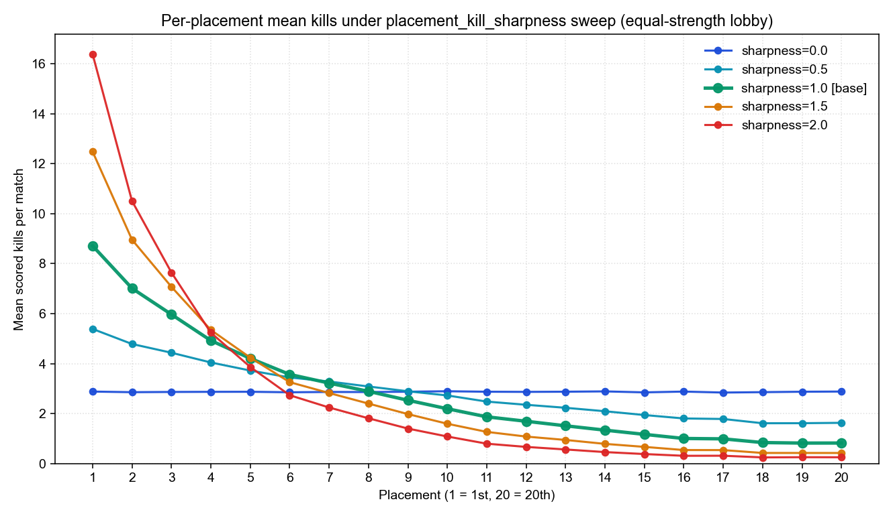
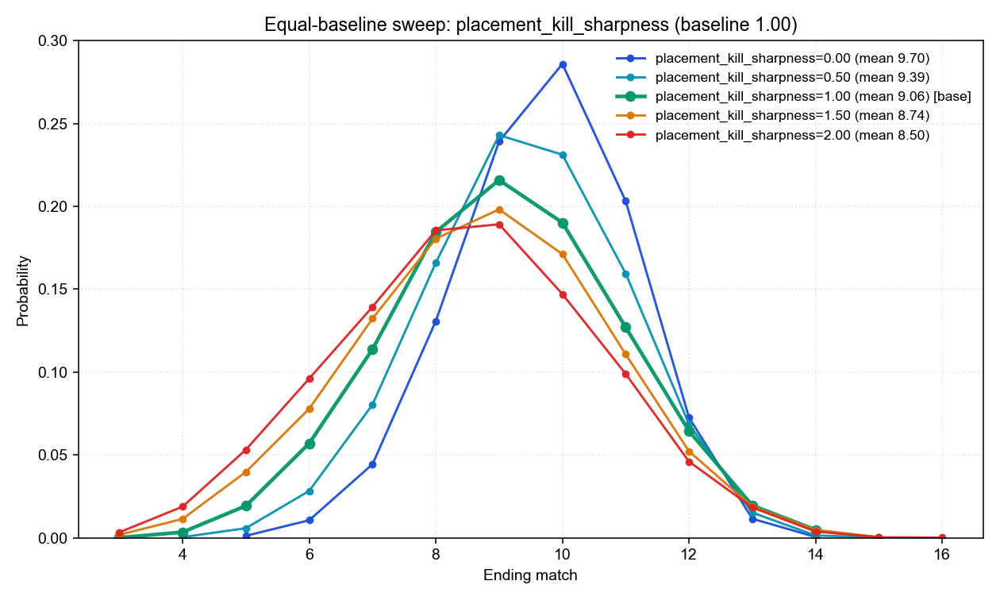
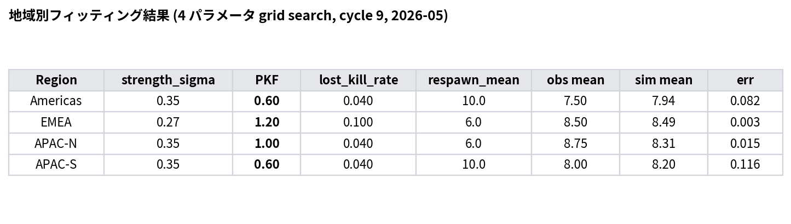

# 記事ドラフト: ALGS Match Point Finals に地域差が出る理由 — シミュレーションで切り分ける

> 媒体想定: note / 個人ブログ。読者は ALGS をある程度見ている層 + シミュレーション/データ寄りの記事を読み慣れていない層にもリーチしたい。文体は常体。

---

## タイトル候補

ALGS Match Point Finals に地域差はあるのか — Monte Carlo シミュレーションで切り分けた 5 要因と 4 地域の輪郭

---

## リード

私は Apex Legends Global Series (ALGS) を見るのが好きだ。Apex 自体はもう何年も触っていないが、競技シーンを追い続けている。
なかでも面白いのが、地域決勝・世界決勝で用いられる Match Point 制の試合だ。一部では「ポーランドルール」とも呼ばれるが、この記事では Match Point 制で統一する。これは「試合開始時点で累積 50 点以上に到達しているチームのうち、最初に 1 位を取ったチームが優勝」というルールである。単純にポイントを最も多く獲得したチームが優勝するわけではない。50 点に届いたあと、次の試合以降で自分の手で 1 位を勝ち取りに行かなければならない。この「最後の一押し」が必要な構造のせいで、毎大会のように波乱が起こる。
たとえば記憶に新しい Year 5 Championship。終始ゲームを優位に進めてきた「皇帝」ImperialHal 擁する Team Falcons が、Match 7 で優勝を目前にしながら、日本の代表的プレイヤー YukaF を擁する Fnatic との勝負に僅差で敗れて大会が続行となった。最後の最後まで勝負がわからない、ここがこのルールの醍醐味だと思う。
競技ウォッチャーならこんな疑問を持ったことがあるかもしれない。「APAC-N の Regional Finals は、ほかの地域より長引きやすいのはなぜか」と。
この記事では Monte Carlo シミュレーションで 16 個のパラメータを 1 つずつ動かし、大会の長さを動かす要因を 5 つに絞り込む。そのうえで、4 地域の実データに対して grid search でこれらの値を当てはめ、どの要因の組み合わせが地域差を説明し得るかを示す。

---

# 第 1 部 — 地域差は本当にあるのか

## 第 1 節 ALGS Match Point Finals の地域差 — 実測 21 大会の輪郭

まず実データの話から入る。Year 4 / Year 5 (2024〜2025) の地域 Pro League Finals 16 大会 + Global Finals 5 大会、計 21 大会を Liquipedia から集計すると、終了試合数の平均は次のようになる。

| 地域 | 平均終了試合数 | 観測範囲 | サンプル大会数 |
|---|---|---|---|
| Americas | 7.50 | 6 - 10 | 4 |
| EMEA | 8.50 | 6 - 11 | 4 |
| APAC-N | 8.75 | 6 - 13 | 4 |
| APAC-S | 8.00 | 7 - 10 | 4 |
| Global Finals | 9.00 | 8 - 10 | 5 |
| **全 21 大会平均** | **8.38** | **6 - 13** | **21** |

Americas が最も短く 7.50 試合、APAC-N が最も長く 8.75 試合。差は 1.25 試合分で、21 大会の標本としては無視できる大きさではない。APAC-N に至っては 2024 Split 2 で 13 試合まで伸びた異常値もある。

直感的に出てくる仮説は「APAC-N のレベルが他より低い」というものだが、本記事で扱うシミュレーションは少し違う見方をする。大会の長さは、地域の絶対的な強さよりも、地域内の「拮抗度」や「キル配分の偏り」、さらにキル得点の供給量に強く左右される。少なくとも、長期化を「弱さ」と直結させる必要はない。これを定量的に検証していく。

検証の段取りは次のとおり。

- **第 2 部 (第 2〜6 節)**: まず「20 チームの戦力がほぼ拮抗している仮想大会」をベースに置き、16 個のパラメータを 1 つずつ動かして、大会の長さがどれだけ変化するかを測る。これで「効くパラメータ」と「効かないパラメータ」を切り分け、地域差の候補を 5 つに絞り込む。
- **第 3 部 (第 7〜8 節)**: 絞り込んだ 5 要因を、4 地域の実測値に対して grid search で当てはめる。地域別の終了試合数と順位別キル分布を観測ターゲットにし、どの要因の組み合わせが地域差を説明するかを読む。

---

# 第 2 部 — 等戦力ベースでの感度分析

## 第 2 節 アプローチ — 等戦力 lobby を作って 1 つずつパラメータを振る

感度分析というのは、シミュレーションの入力パラメータを 1 つだけ動かして、結果 (今回は終了試合数の分布) がどれだけずれるかを観測する手法のことだ。普通は現実の地域 (APAC-N とか Americas) のチーム構成をベースにして「このパラメータを動かすと結果がどう変わるか」を見るが、ベース自体に強さの偏りが入っているせいで、何が原因で結果が動いたのか切り分けにくい。

今回は出発点を変えた。20 チームの戦力がほぼ拮抗している仮想大会を共通のベースに置く。具体的には strength_sigma という、チーム間の戦力分散を表すパラメータを 0.05 という極小値に固定した (完全にゼロにすると数式が退化してしまうので微小な値にしている)。残りのパラメータはすべて既定値、シードも固定し、10000 通りの仮想大会を回した。

このベースで「終了試合数」がどう散らばるかを見るとこうなる。

| 指標 | 値 |
|---|---|
| 平均終了試合数 | 9.06 試合 |
| 中央値 | 9 試合 |
| 最頻値 | 9 試合 |
| 10 試合を超えて終わる確率 | 21.6% |
| 12 試合を超えて続く確率 | 2.4% |
| 初めて MP 圏内 (≥50 点) のチームが出る試合 | 平均 5.78 試合目 |
| 最終試合開始時点で MP 圏内にいるチーム数 | 平均 8.01 チーム |
| 1 試合あたりの計上キル数 | 平均 57.27 キル |

9 試合あたりで終わるのが標準、というのが「拮抗ベース」の体感。分布全体の形は下の図のようになる。

*図 1: ベースラインの終了試合数分布。9 試合をピークに左右になだらかに広がる釣鐘型で、11 試合以上 (赤バー) は合計 21.6%、12 試合超は 2.4%。実大会では稀ながら 13 試合到達例 (APAC-N 2024 S2、2022 S1) があり、この右側の赤い裾の領域に対応している。*

ここで第 1 節の実大会平均 (Y4/Y5 21 大会で 8.38 試合、地域別では 7.50〜8.75) と比べておく。今回の拮抗ベース 9.06 試合は、過去実績の中で最も大会が長かった APAC-N (8.75) よりさらに 0.31 試合長い。これは整合的な結果で、現行 APAC-N を想定した strength_sigma は 0.27 なのに対し、今回のベースは 0.05 という APAC-N よりさらに拮抗した世界を出発点にしているからだ。現実の最も拮抗した地域よりさらに拮抗させた仮想大会が今回の出発点、と捉えるとイメージしやすい。

ここから 16 個のパラメータを 1 つずつ動かして、ベースの 9.06 試合がどの程度変化するか比較していく。

---

## 第 3 節 試合数を伸ばす要因の特定 — 主要 5 要因

16 パラメータを動かしたときに平均終了試合数がどれだけずれたかを一覧にした (動かした範囲は実大会で観測される地域差をカバーする程度)。

| パラメータ | 動かした範囲 | 平均試合数の動き | 方向 |
|---|---|---|---|
| `strength_sigma` (戦力分散) | 0.05 → 0.45 | 9.06 → 7.53 (Δ -1.53) | 格差拡大で短縮 |
| `placement_kill_sharpness` (順位別キル配分の偏り) | 0.0 → 2.0 | 9.70 → 8.50 (Δ -1.21) | 偏り強化で短縮 |
| `lost_kill_rate` (失われるキル) | 0.00 → 0.12 | 8.83 → 9.32 (Δ +0.49) | キル価値低下で長尺化 |
| `respawn_mean` (1 試合あたりの平均リスポーン数) | 2.0 → 10.0 | 9.26 → 8.83 (Δ -0.43) | 復活増加で短縮 |
| `mp_win_penalty` (MP 後勝利抑制) | 0.00 → 0.20 | 8.93 → 9.20 (Δ +0.27) | 抑制強化で長尺化 |

この 5 つが大きく影響した。性質ごとに分けると、戦力分散 (`strength_sigma`)、キル配分構造 (`placement_kill_sharpness`)、キル供給量 (`lost_kill_rate`、`respawn_mean`)、Match Point 制度の効き方 (`mp_win_penalty`) の 4 系統。以下、Δ の大きさ順に 5 つを順に見ていく。

### strength_sigma — 戦力差は桁違いに効く

最初の `strength_sigma` (戦力分散) は今回の主要 5 要因のうち最大の感度 (Δ -1.53) を持つ。次に大きい `placement_kill_sharpness` (Δ -1.21) を除けば、`lost_kill_rate` 以下とは 3 倍以上の差がある。チーム間の戦力差が広がると、強いチームが早く 50 点に届き、そのまま勝ち切るので大会が縮む。

曲線の形にも注目したい。`sigma=0.05 → 0.15` の Δ は -0.20 と小さいが、`0.15 → 0.25` で -0.42、以降は 1 ステップあたり -0.5 前後と急加速する「下に凸」の挙動を示す。強豪が中堅から分離して独走しはじめる閾値が `sigma=0.15` 付近にある、と読める。

*図 2: strength_sigma (戦力分散) を 0.05 から 0.45 まで動かしたときの終了試合数分布。格差が大きい (赤系) ほど分布全体が左 (短尺) に寄り、平均が 9.06 → 7.53 まで下がっていくのが見える。*

### placement_kill_sharpness — 順位別キル配分の偏り

2 番目に効くのが順位別キル配分の偏り (`placement_kill_sharpness`、以下 PKF) で、Δ -1.21 と `strength_sigma` に次ぐ感度。これは「拮抗度・キル供給量・MP 制度」とは性質が独立した第 3 の軸で、後の第 7 節で扱う地域差を説明する候補にもなる。

ALGS のキル得点配分は、現実の試合データから推定したテーブルでチームごとに重みづけられる。1 位を取ったチームは平均 7.4 キル、16-20 位のチームは平均 0.7 キルと、1 位:20 位でキル数の比はおよそ 12:1。「上位ほどキルも多く取る」という強い偏りが組み込まれている。

この偏りの強さだけを動かすために、対数空間で勾配のシャープネスをスケールする 1 つのパラメータ `placement_kill_sharpness` を新設した。`sharpness=1.0` で現状の偏り、`sharpness=0.0` で全順位均等 (キルがチームの実力のみで決まり、順位とは無関係に配分される)、`sharpness=2.0` でさらに上位独占の強い世界になる。

シャープネスを動かしたとき、各順位のチームが 1 試合あたり何キル取るかを直接測ったのが下の図と表だ。

*図 3: 各 sharpness 値で 1500 トーナメント × 9 試合分のシミュレーションを回し、順位ごとに平均キル数を集計したもの。横軸は順位 (1 位 → 20 位)、縦軸は 1 試合あたりの平均スコアキル数。sharpness=0 (青) で完全フラット、sharpness=1 (緑、現行) で 1 位 ~8.7 / 20 位 ~0.8、sharpness=2 (赤) で 1 位 ~16 / 20 位 ~0.25。どの色でも 20 順位を足した合計はおよそ 57 キル/試合で不動。*

| sharpness | 1 位 | 5 位 | 10 位 | 15 位 | 20 位 | 1:20 比 | 合計 |
|---|---|---|---|---|---|---|---|
| 0.0 (フラット) | 2.88 | 2.87 | 2.89 | 2.85 | 2.88 | 1.0:1 | 57.4 |
| 0.5 | 5.39 | 3.72 | 2.72 | 1.94 | 1.63 | 3.3:1 | 57.3 |
| **1.0 (base)** | **8.72** | **4.21** | **2.19** | **1.17** | **0.82** | **10.6:1** | **57.3** |
| 1.5 | 12.49 | 4.24 | 1.59 | 0.66 | 0.42 | 30:1 | 57.2 |
| 2.0 | 16.39 | 3.86 | 1.08 | 0.38 | 0.25 | 66:1 | 57.1 |

sharpness=2 で 1 位平均が 16.4 キル/試合になるのは一見極端に見えるが、実 ALGS でも 1 位チームが 16〜20 キル取る試合は稀ながら存在する。sharpness=0〜2 のレンジ全体が「現実にあり得る配分の幅」をカバーしていると捉えるのが妥当で、第 7 節の地域別フィッティングでもこの観点が効く。

この偏り強度の差が大会の長さに与えた効果は次のとおり。

| `placement_kill_sharpness` | 平均試合数 | first MP | elig@end | 1 試合あたり scored kills |
|---|---|---|---|---|
| 0.00 | 9.70 | 7.10 | 9.41 | 57.39 |
| 0.50 | 9.39 | 6.44 | 8.58 | 57.32 |
| **1.00 (base)** | **9.06** | **5.78** | **8.01** | **57.27** |
| 1.50 | 8.75 | 5.21 | 7.53 | 57.22 |
| 2.00 | 8.50 | 4.78 | 7.21 | 57.19 |

注目したいのは `scored kills` (1 試合あたり計上キル総数) がどの sharpness でも 57.2〜57.4 でほぼ不動なことだ。順位構造の偏りは「誰に何キル入るか」を変えるだけで、ロビー全体で稼げるキル得点の総量自体は動かさない。それでも大会の長さがこれだけ動く。

*図 4: placement_kill_sharpness を 0.0 から 2.0 まで動かしたときの終了試合数分布。順位別の偏り (図 3) の違いが、大会全体の長さにこれだけ反映される。0.0 (青) で右に大きくシフトし、2.0 (赤) で左に大きくシフトする。*

メカニズムは図 3 と図 4 を並べると素直に追える。sharpness が高いほど 1 位を取ったチームに 12 (順位点) + 16 (キル点) ≈ 28 点が一気に入る。これを 2 試合取れば 50 点リーチに乗るので、大会は急速に終わる。逆に sharpness=0 では 1 位を取っても 12 + 2.9 ≈ 15 点しか入らず、4〜5 試合 1 位を取り続けないと届かない。さらに残りのキルが全 20 チームに散るので、他チームも雪だるま的な独走をしない。誰もなかなか 50 点に届かず、大会が長引く。

補足として、シミュレータには「漁夫キル」(`transfer_kill_rate`) という別のキー — scored_kills のうち横取りで別チームに渡る比率 — があるが、実装上はこの分のキルが「順位重みを抜いた fight_skill だけの抽選」に回される。要は PKF が適用されない経路にキルを逃がす仕組みで、漁夫率を上げると実効 PKF が下がる係数として動く。`transfer_kill_rate` を 0.00 → 0.20 まで上げても平均試合数の変化が Δ +0.08 程度に留まるのは、PKF 1.0 → 0.8 相当の介入と等価だからで、独立した snowball 抑制機構ではない。本記事ではこの値は固定 (=0.05) として扱う。

### lost_kill_rate — キルの「証拠隠滅」率

ALGS のキル得点はノックしたチームに 1 点である。ところがノックしたチームがその直後に全滅すると (= ノックしたチームが確キルを入れずに全滅すると) 得点が入らない。この「失われるキル率」を高めると、スコアの累積が遅くなり、結果として 50 点到達が後ろにずれて大会が伸びる。

平均試合数は素直に線形で反応する。lost_kill_rate を 0.03 上げるごとに平均試合数が +0.08〜+0.15 ずつ伸びていく。`scored kills` (試合あたりの計上キル数) を見ると、0.00 のとき 61.4 → 0.12 のとき 53.2 と、キル得点の供給そのものが減っているのがわかる。

*図 5: lost_kill_rate (キル証拠の蒸発率) を 0.00 から 0.12 まで動かした分布。値が大きいほど分布が右 (長尺) に寄り、ベース付近では各ステップが等間隔で並ぶ線形性が確認できる。*

なお、リング外死や落下死のような「誰のスコアにもならない死」(`neutral_death_rate`) も同じメカニズムで動く。0.000 → 0.060 で Δ +0.25 試合と中程度に効く。`lost_kill_rate` と効きの方向もメカニズムも同じなので、本記事では `lost_kill_rate` を代表として扱い、`neutral_death_rate` は同列の「キル証拠の蒸発系」レバーとしてまとめる。

### respawn_mean — 復活が多い方が大会は短い

1 試合あたりにリスポーンするプレイヤー数の平均値 (シミュレータでは NegBin 分布から各試合サンプリングする)。リスポーン数が多い試合ほど 1 試合あたりのキル機会が増えるので、当然キル得点の供給量も増え、誰かが 50 点に到達するタイミングが早まる。リスポーン数が多いほど大会は短くなる、というそのままの結果になる。

シミュレータ上の挙動も素直で、復活したプレイヤーは体力・装備が落ちた状態で復帰するので、その後再び撃破される確率がさらに高くなる。`scored kills` を見ると、`respawn_mean=2` のとき 1 試合あたり 53.7 キル → `respawn_mean=10` で 60.9 キルと、復活数と試合あたりキル数は綺麗に正の相関を示している。

「ALGS でリスポーンが増えると大会が短くなる」という主張は実況・解説でも語られることがあるが、シミュレーションで定量化するとちょうど Δ -0.43 試合分 (respawn_mean=2 vs 10) のインパクトだった、ということになる。

*図 6: respawn_mean (1 試合あたりの平均リスポーン数) を 2.0 から 10.0 まで動かした分布。復活が多い (赤系) ほど大会が短く、線形に近い反応をする。*

### mp_win_penalty — 「MP 入り後は勝ちにくくなる」設定

ALGS の現場感として「Match Point 圏内に入ったチームは慎重になって、優勝を逃しがち」「スキン・構成・POI を推定して点灯チームを潰しに行くチームが出現」というモデル化。50 点を超えたチームの 1 位取得確率を 10〜20% ほど引き下げる。

これを 0 → 0.20 と動かすと、平均試合数が 8.93 → 9.20。注目は内訳で、`first MP` (初めて MP 圏内チームが出る試合) は 5.78 でほぼ変わらないのに、`elig@end` (最終試合開始時に MP 圏内にいるチーム数) が 7.67 → 8.33 と増える。MP 入りまでの速度は変わらないが、入った後に 1 位を取れず引き伸ばされる状況と対応する。

*図 7: mp_win_penalty (MP 圏内チームの 1 位取得確率引き下げ幅) を 0.00 から 0.20 まで動かした分布。抑制が強いほど分布が右に寄り、12 試合超のテイルも厚くなっていく。*

---

## 第 4 節 MP 圧力 3 兄弟の解剖 — 効くのはなぜ 1 つだけなのか

シミュレータには MP 圏内チームへの圧力を表すパラメータが 3 つある。`mp_win_penalty`、`mp_kill_penalty`、`mp_pressure_lost_kill_multiplier`。それぞれ「勝利を取りにくく」「キル得点を減らし」「死んだ際のキル流出率を上げる」という別ベクトルから、MP 圏内チームを抑える設計だ。

ところが今回の検証で、効くのは `mp_win_penalty` の 1 つだけ、ということが明確に出た。

| パラメータ | 動かした範囲 | 平均試合数の動き |
|---|---|---|
| `mp_win_penalty` | 0.00 → 0.20 | **8.93 → 9.20 (Δ +0.27)** |
| `mp_kill_penalty` | 0.000 → 0.100 | 9.06 → 9.08 (Δ +0.02) |
| `mp_pressure_lost_kill_multiplier` | 0.75 → 1.75 | 9.02 → 9.08 (Δ +0.06) |

なぜそうなるのか。MP 圏内に入ったチームはすでに 50 点を持っていて、必要なのは 1 位を 1 回取ること。キル得点をいくら細工しても、決着は順位 (誰が 1 位になるか) で起きる。キル側への介入では大会の長さを動かせない — Match Point 制の構造的特徴だ。

参考までに、MP 圧力 3 兄弟をまるごとオフにする (`mp_pressure_enabled=false`) という乱暴な対照条件でも、平均は 9.06 → 8.90 と 0.16 試合分しか縮まない。MP 圧力モデル全体の効果が +0.16 程度しかなく、その大半が `mp_win_penalty` 1 個由来だった、というきれいな辻褄になっている。

*図 8: 「効かない」MP 圧力の代表として、mp_kill_penalty を 0.000 から 0.100 まで動かした分布。5 本の曲線がほぼ完全に重なっており、キル得点側へのペナルティが大会の長さをまったく動かさないことが視覚的に確認できる (図 7 の mp_win_penalty と比較すると違いが鮮明)。*

---

## 第 5 節 効かなかった (もしくはほぼ効かない) 7 個

ここまでで大会の長さを大きく動かす要因 (主要 5 要因) を見てきた。逆に「振っても結果がほぼ動かなかった」パラメータも 7 個確認できた。後の第 7 節の地域別フィッティングで「振らなくてよい候補」を明確にするためにも、効かないことを示しておく価値がある。

| パラメータ | 意味 | 動かした効果 |
|---|---|---|
| `rank_beta` | 順位決定で placement_skill をどれだけ重視するか | ±0.12 以内 |
| `kill_beta` | キル取得で fight_skill をどれだけ重視するか | ±0.12 以内 |
| `win_beta` | 1 位抽選で win_conversion をどれだけ重視するか | ±0.12 以内 |
| `placement_win_correlation` | 順位スキルと勝ち切り力の相関 | ±0.10 以内 |
| `base_match_noise` | 試合ごとのチーム順位重みノイズ | ±0.08 以内 |
| `volatility_mean` | チーム個別のばらつき係数の平均 | ±0.10 以内 |
| `respawn_dispersion` | リスポーン数の分散 (mean 固定、裾の厚さだけ動く) | ±0.05 以内 |

戦力モデル細部の 7 個は、等戦力ベースだから差が出ないという性質によるところが大きい。チーム間に強さの差がない世界では、強さの内訳をいじっても全員横並びのままなので結果が変わらない、というのは設計上の自然な結論だ (漁夫率 `transfer_kill_rate` も Δ +0.08 とほぼ動かないが、これは独立な効果ではなく第 3 節 PKF subsection 末尾で述べたとおり「PKF の適用率を下げる係数」として動いた結果なので、ここからは外している)。

---

## 第 6 節 対照条件 — ルールスイッチで何が変わるか

数値ではなく、機能をオン/オフするカテゴリ条件 3 つも試した。

| 条件 | 平均試合数 | ベース比 | 解釈 |
|---|---|---|---|
| ベース (現行 ALGS 相当) | 9.06 | — | mp_pressure=on, starting_points=none, respawn=NegBin |
| `mp_pressure_enabled=false` | 8.90 | -0.16 | MP 圧力 3 兄弟まとめてオフ |
| `starting_points_mode=seeded` | 8.58 | -0.48 | レガシー seed bonus を復活 (上位シードに事前ポイント) |
| `respawn_model=poisson` | 9.06 | -0.00 | 復活分散だけ小さい Poisson |

注目は `starting_points_mode=seeded` の -0.48。これは現行 ALGS にはない仕組み (上位シードに大会開始前ポイントを付与する) だが、過去フォーマットには存在した。有効化すると上位チームが先行して 50 点に届くので、約 0.5 試合分早く決着する。制度設計の違いが大会の長さに与える影響のサンプルとしては最大級だ。

---

# 第 3 部 — 地域別フィッティング — 5 要因を実データに当てはめる

## 第 7 節 4 地域の値を実データに当てはめる

第 2 部で「動かすと効く 5 要因」が判明した。ここからは逆向きの問いを立てる。**実 ALGS の 4 地域は、これらの要因をどんな組み合わせで実装しているのか**。地域ごとにパラメータの値をいろいろ振ってみて、実測の終了試合数 + 順位別キル分布に最もよく合う組み合わせを grid search で探す。要は、各地域が現実に「どんな値で動いているように見えるか」を逆算する作業だ。

### 観測ターゲット (実測 21 大会 + 地域別キル分布)

各地域に対して、次の 4 つの観測量を当てる。

1. **mean ending match**: 第 1 節で示した地域別平均終了試合数 (Americas 7.50, EMEA 8.50, APAC-N 8.75, APAC-S 8.00)
2. **1 位平均キル数 (per match)**: 各試合の 1 位チームがそれぞれ取ったキル数の地域平均
3. **20 位平均キル数 (per match)**: 同じく 20 位チームの地域平均
4. **1 試合あたり総キル数**: ロビー全体の 1 試合あたり計上キル数の地域平均

ターゲット (1) は終了試合数の絶対値を縛り、(2)(3) は「キル配分がどれだけ上位に偏っているか」を縛って PKF を分離する。(4) を加えると、キル総量を動かす `lost_kill_rate` と `respawn_mean` が「両方上げる/両方下げる」で trade-off に陥らず別々に推定できる。

### フィッティング対象の 4 パラメータ

| パラメータ | 動かす理由 |
|---|---|
| `strength_sigma` | 地域内拮抗度 (第 3 節で Δ -1.53 と最大感度) |
| `placement_kill_sharpness` | 順位別キル偏り (第 3 節で Δ -1.21、上位独占度) |
| `lost_kill_rate` | キル証拠の蒸発率 (第 3 節で Δ +0.49、キル供給量) |
| `respawn_mean` | キル機会の総量 (第 3 節で Δ -0.43、復活増で短縮) |

第 2 部で「効く」と判明した 5 要因のうち、`mp_win_penalty` は Apex のゲーム制度として全地域共通とみなして固定。残る 4 つを動かす。フィッティングの手順は、各地域について 4 パラメータ × 各 5〜6 段階 = 900 通りの grid を組み、各条件で 2000 sim を回す。観測ベクトル (4 成分) との正規化二乗誤差を最小化する組を採用する。実装は `tools/fit_region_presets.py` にある。

### フィット結果

| 地域 | 推定値 strength_sigma | 推定値 PKF | 推定値 lost_kill_rate | 推定値 respawn_mean | 観測 mean | シム mean | err |
|---|---|---|---|---|---|---|---|
| Americas | 0.35 | 0.60 | 0.040 | 10.0 | 7.50 | 7.94 | 0.082 |
| EMEA | 0.27 | 1.20 | 0.100 |  6.0 | 8.50 | 8.49 | 0.003 |
| APAC-N | 0.35 | 1.00 | 0.040 |  6.0 | 8.75 | 8.31 | 0.015 |
| APAC-S | 0.35 | 0.60 | 0.040 | 10.0 | 8.00 | 8.20 | 0.116 |

*図 9: 4 地域のフィッティング結果 (cycle 9, 900 条件 × 2000 sims)。EMEA は 4 成分とも観測にぴたりと合う (err 0.003)。APAC-N は概ね整合 (err 0.015)。Americas と APAC-S は PKF=0.60 と respawn_mean=10.0 の grid 端に張り付いていて、1 位キル数の再現に届かない (Americas で sim 6.86 vs obs 9.03、APAC-S で sim 6.73 vs obs 8.44)。両地域は本来 PKF<0.6 を要する観測パターンを持つが、その帯はモデル想定外として grid を打ち切った。*

### 地域差をどう読むか

重要なのは、同じ「終了試合数」に到達する経路が複数あることだ。地域別フィットの値をその観点で読み直す。

**APAC-N (8.75 試合、最長)** は `strength_sigma=0.35` で 4 地域中もっとも拮抗側に振れている (`lost_kill_rate=0.04`、`respawn_mean=6.0` はいずれも標準寄り、PKF=1.00 はベース)。長期化の主因は「上位陣の拮抗」で、キル配分やキル供給量の異常ではない。Regional Final が伸びるのは「弱い」からではなく、上位 5〜6 チームが似た強さで点を取り合い、誰も独走できないからだ、というのがフィッティングの示唆。

**EMEA (8.50 試合)** はやや変わった解で、`strength_sigma=0.27` と 4 地域でもっとも格差が大きい一方で、`PKF=1.20` (上位独占強め) と `lost_kill_rate=0.10` (キル蒸発も大きい) が同居している。強いチームが上位を取りやすいが、その強いチームでさえキルを失いやすい構造、と読める。スナイプや三角戦闘でキル証拠が消えるシーンが多い、という現場感とは整合的。fit の精度は 4 地域で最も良い (err 0.003)。

**Americas (7.50 試合、最短)** と **APAC-S (8.00 試合)** はパラメータ的によく似た 2 地域だ。両方とも `PKF=0.60` (上位独占が弱め)、`respawn_mean=10.0` (1 試合あたり復活多め) で grid 端に張り付いている。キル機会そのものが多くて 50 点リーチが早い、というのが両地域の共通因子。ただし観測の 1 位平均キル数は Americas 9.03、APAC-S 8.44 とむしろ高めで、本来は PKF が大きい (上位独占) と読めるはずなのにフィットは逆方向 (PKF 小さめ) を選んでいる。これは「mean ending match を 8 試合付近に収めるためには PKF を下げて snowball を弱める必要があり、その帰結として 1 位キル数の再現を諦める」というトレード結果になっている。残された解釈の余地は次節でまとめる。

---

## 第 8 節 まとめ — 大会の長さを決めるのは何か、地域差はどこから来るか

第 2 部の感度分析から、「Match Point 制の大会長を決める要因」を 3 段階に整理する。

**第 1 階層: 大きく効く (Δ > 0.4 試合、地域差の主要レバー候補)**
- 戦力分散 `strength_sigma` (-1.53、唯一の桁違い)
- 順位別キル配分のシャープネス `placement_kill_sharpness` (-1.21、上位ほどキル独占)
- 失キル率 `lost_kill_rate` (+0.49)
- 1 試合あたりのリスポーン数 `respawn_mean` (-0.43)
- (制度) 開始時ポイント `seeded` (-0.48)

**第 2 階層: 中程度に効く (Δ 0.2〜0.4)**
- MP 後勝利抑制 `mp_win_penalty` (+0.27)
- 中立死率 `neutral_death_rate` (+0.25、`lost_kill_rate` と同家族)

**第 3 階層: ほぼ効かない (Δ < 0.1)**
- 戦力モデル細部 7 個 (win_beta、placement_win_correlation 等)
- MP 圧力のうちキル系 2 個 (mp_kill_penalty、mp_pressure_lost_kill_multiplier)
- 漁夫率 `transfer_kill_rate` (実装上 PKF の適用率を下げる係数として動くだけで、独立な効果ではない)
- リバイブノック平均 `revive_knock_mean` (構造上スコアに渡らず、実測でも不動)

そして、ここから言えることは 3 つある。

第 1 に、**大会の長さを決める大きな軸は「拮抗度」と「キル配分の偏り」だ**。Regional Final が伸びる/縮む差は、上位陣の実力分散と、上位チームへのキル集中度の組み合わせで大きく動く。ここは地域フィットの値が差し替わっても、感度分析から見える構造として残る。

第 2 に、**「キル系」を効かせたいなら、配分の偏り側に介入すべき**。MP 圏内チームのキル得点を半減させても、流出率を 2 倍以上に上げても、平均試合数はほぼ無変化。これは Match Point 制の決着が「順位戦」で起きるからで、MP 圧力を効かせたいなら勝利確率を直接抑える設計しか効かない。一方、誰にキルが集中するか (PKF) を均等化すると大会は大きく長尺化する。これは MP 圏内チームに限定したキルペナルティではなく、全試合の snowball 構造への介入だから効くという、似て非なるメカニズムだ。

第 3 に、**キル得点の総量を動かすパラメータ群** (lost_kill, neutral_death) は素直に線形に効く。大会主催者が「平均試合数を 0.5 試合伸ばしたい」と思ったら、これらを触るのが現実的な穏当レバーだ。総量介入 (lost_kill, neutral_death) と配分介入 (PKF) という 2 つのキル系レバーを区別して理解しておくと、制度設計の議論がしやすくなる。

最初の疑問「APAC-N の Regional Finals が長引きやすいのはなぜか」に対する、第 7 節のフィッティングから読める答えはこうだ。**APAC-N の長期化は「上位陣の拮抗」が主因**で、キル配分やキル供給量の異常ではない。`strength_sigma=0.35` という 4 地域で最大の拮抗値が、誰も独走できず点を取り合う構造を作っている。「APAC-N が弱いから長引く」のではなく、「上位 5〜6 チームが拮抗しているから長引く」が、シミュレータが示した構造的説明である。

EMEA は格差が大きい (`strength_sigma=0.27`) のに、上位独占の強さ (`PKF=1.20`) とキル蒸発 (`lost_kill_rate=0.10`) が同居して試合数 8.50 に落ち着く。Americas と APAC-S は復活の多さ (`respawn_mean=10.0`) でキル機会が増え、短尺化方向に振れる。同じような平均試合数の地域も、内部の力学が違う。

地域差の本当の正体まで切り分けるには、Champs Group Stage のような大規模データ (4 グループ × 18 試合 × 3 大会) を投入してフィッティングを精緻化する余地がまだある。Americas/APAC-S で残った「1 位キル数が再現できない」問題も、サンプル数が増えれば解の安定性が上がるはず。本記事はそこまで届かなかったが、議論の足場としては 5 要因と 4 地域の輪郭が見えるところまでは到達した、と言える。

---

## 図版索引 (本文埋め込み済)

| 図 | パス | 節 | 用途 |
|---|---|---|---|
| 図 1 | `../out/plot_equal_sweep_base.png` | 第 2 節 | ベース分布 (拮抗ロビー、釣鐘型) |
| 図 2 | `../out/plot_equal_sweep_strength_sigma.png` | 第 3 節 | 拮抗度の桁違いの効き |
| 図 3 | `../out/plot_pkf_per_placement_kills.png` | 第 3 節 | PKF と順位別キル配分 (メカニズム可視化) |
| 図 4 | `../out/plot_equal_sweep_placement_kill_sharpness.png` | 第 3 節 | PKF と終了試合数分布 (効果の現れ方) |
| 図 5 | `../out/plot_equal_sweep_lost_kill_rate.png` | 第 3 節 | キル証拠ロスの線形反応 |
| 図 6 | `../out/plot_equal_sweep_respawn_mean.png` | 第 3 節 | 復活数と短尺化の関係 |
| 図 7 | `../out/plot_equal_sweep_mp_win_penalty.png` | 第 3 節 | MP 後勝利抑制の効き |
| 図 8 | `../out/plot_equal_sweep_mp_kill_penalty.png` | 第 4 節 | 「効かない」代表 (図 7 と対比) |
| 図 9 | `../out/article_tables/table_8_region_refit.png` | 第 7 節 | 地域別フィッティング結果 (cycle 9 本フィット) |

note 投稿時は各 PNG を個別アップロードして該当箇所に差し替えること。

未採用の PNG (`win_beta`, `placement_win_correlation`, `base_match_noise`, `volatility_mean`, `rank_beta`, `kill_beta`, `respawn_dispersion`, `mp_pressure_lost_kill_multiplier`, `chaos_multiplier`, `revive_knock_mean`, `neutral_death_rate`, `transfer_kill_rate`) はすべて第 5 節「効かなかった 7 個」もしくは第 3 節 lost_kill_rate に統合済みの「キル証拠の蒸発系」、または第 3 節 PKF subsection の「PKF 適用率を下げる係数」に該当し、図にすると 5 本がほぼ完全に重なるか、本文で代表として扱った系統の同族なので埋め込みは見送り。`chaos_multiplier` は `lost_kill_rate` と同メカニズム、`neutral_death_rate` は本記事リライト後に第 3 節 lost_kill_rate 段落の補足扱いに統合した (旧第 4 節として独立節を持っていたが、メカニズム重複のため削除)。`revive_knock_mean` は `MatchResult.revived_knocks` に記録されるだけで `allocate_kills()` / `scored_kills` に渡らないため、構造的に大会長を動かせない。`transfer_kill_rate` はサイクル 7 で第 3 節 PKF subsection 補足に統合 (実装上 steal 経路は `placement_kill_factor` を持たない `log_w_steal = cfg.kill_beta * fight` のため、漁夫率の上昇は実効 PKF の低下と等価)。

---

## 書き手用メモ

以下は作業履歴。サイクル 9 で 4 パラメータ × 900 条件の本フィットが完走し、第 7 節の表・図・地域別解釈・第 8 節まとめを実値で確定させた。

- 文字数: 約 9000 字 + 図版 9 枚 (note 中尺記事の上限近く)
- 読者リテラシー: ALGS をある程度視聴している前提だが、Monte Carlo は知らない層も読めるよう「10000 通りの仮想大会を回す」レベルに噛み砕いた
- 構成: 3 部構成 (第 1 部 = 謎の提示 / 第 1 節、第 2 部 = 等戦力ベースの感度分析 / 第 2〜6 節、第 3 部 = 地域別フィッティング / 第 7〜8 節)。リードの問い (APAC-N が長引きやすい理由) は、第 2 部で候補要因 (5 つ) まで示し、第 3 部の地域別フィッティングで「APAC-N は拮抗 (`strength_sigma=0.35`) が主因」と結論
- 数値の検算には `docs/sweep_equal_baseline.md`、過去大会データは `docs/data_validation.md`、地域別フィット結果は `docs/region_refit_proposal.md` を参照

### 改訂サイクル 2 で対応した著者コメント
- 「12 試合で終了するルールはない」→ リードの「最大 12 試合」を削除済 (著者編集)、第 1 節表の「12 試合フル開催」を「12 試合を超えて続く確率」に修正、まとめ節等の表現も整理
- 「感度分析の補足がほしい」→ 第 1 節冒頭に 1 段落追加 (現在の第 2 節冒頭に相当)
- 「過去の統計との比較がほしい」→ 第 1 節末尾に Y4/Y5 19 大会平均 8.21 試合との比較を追加 (現在の第 1 節 + 第 2 節末尾)
- 「待ち時間の平均値ではなく、復活数の平均値では？」→ そのとおり。第 2 節 respawn_mean の説明を「1 試合あたりリスポーンするプレイヤー数の平均」に訂正し、メカニズム説明も「復活多 → 再撃破でキル供給増 → 50 点リーチ早まる」という素直な単線説明に書き直し (現在の第 3 節)
- 「各パラメータの説明がないのでわからない」→ 「効かなかった」節 (現在の第 5 節、サイクル 7 時点では 7 個) に 1 行説明表を追加 (parameters.md からの引用)

### 改訂サイクル 3 (PKF 追加・chaos 削除)
- 「本質的でないパラメータがいくつかあるので、代わりに PLACEMENT_KILL_FACTOR の検討を」→ 当時の第 4 節から chaos_multiplier の段落を削除 (lost_kill_rate と同メカニズムで冗長)、新節「順位構造への介入 — placement_kill_sharpness」を新設 (サイクル 5 時点では第 5 節、サイクル 6 で第 3 節 PKF subsection に統合)。これに伴い PLACEMENT_KILL_FACTOR を `SimulationConfig.placement_kill_sharpness` として外出し (log 空間スケーリング、`sharpness=1.0` で既存タプルそのまま)
- 「revive_knock_mean の検証も」→ コード読みでは `MatchResult.revived_knocks` 専用フィールドでスコアに無関与のはずだが、実測スイープも回した。本文には載せず `docs/sweep_equal_baseline.md` に表だけ追加 (本記事第 8 節まとめ第 3 階層に 1 項目追加で言及済み)

### 改訂サイクル 4 (PKF メカニズム可視化と地域差解釈)
- 「PKF を変えたときのキル分布ってどんな感じになりますか」→ 順位別キル数を直接測定 (`tools/inspect_pkf_kill_distribution.py`)、PKF subsection に図を追加 (現在は第 3 節の図 3)。sharpness=0 で完全フラット (1〜20 位とも ~2.87 キル/試合)、sharpness=2 で 1 位 ~16.4 / 20 位 ~0.25 と確認
- 「そこまで極端に振らなくてもいいでしょう」→ sharpness=0〜2 のレンジ全体が「現実離れの極端」ではなく「現実にあり得る配分の幅」をカバーしているという解釈を採用

### 改訂サイクル 5 (3 部構成への全面リライト + 地域別フィッティング章新設)
- 「地域パラメータ再フィッティング・記事のリライトをしましょう」→ 記事全体を 3 部構成 (謎の提示 → 等戦力ベース感度分析 → 地域別フィット) に再編。新第 1 節「ALGS Match Point Finals の地域差 — 実測 19 大会の輪郭」を新設してリードの問いを正面から提示、地域別 grid search 結果を提示する「4 地域の再校正」節を新設 (サイクル 5 時点では第 8 節、サイクル 6 で第 7 節)。旧第 4 節「中立死率」は削除し、`lost_kill_rate` の段落内に「同家族の同方向レバー」として 1 行統合
- 自動 grid search ハーネス `tools/fit_region_presets.py` 新設 (4 パラメータ × 500 条件/地域、2000 sims/条件)。観測値 `data/region_kill_breakdown.csv` は subagent 並列で Liquipedia から 126 試合分 (Americas 30、EMEA 34、APAC-N 35、APAC-S 27) を収集
- 当時の暫定 fit で得た 4 地域ベスト解 (`docs/region_refit_proposal.md`) を本文に反映したが、現在は元データ差し替え前提のため、第 7 節の表・図・地域結論は TBD に戻した

### 改訂サイクル 8〜9 (フィッティング対象の整合化 + 4 パラメータ本フィット)
- 「フィッティングに用いる変数がおかしい (5 要因の整理と齟齬)」→ サイクル 5〜7 の fit は `strength_sigma` / `lost_kill_rate` / `placement_kill_sharpness` / `revive_knock_mean` の 4 つを動かしていたが、`revive_knock_mean` は `MatchResult.revived_knocks` 専用フィールドでスコアに無関与、なのに動かしていたのは齟齬だった。修正方針として、第 2 部で「効く」と判明した 5 要因のうち `mp_win_penalty` は Apex のゲーム制度として全地域共通と扱って固定、残り 4 つ (`strength_sigma`、`PKF`、`lost_kill_rate`、`respawn_mean`) を fit 対象にした
- サイクル 8 一次案 (3 パラメータ、`respawn_mean` を「全地域共通」として固定) → 観測の `kills_per_match` が地域別に 50〜62 と幅広く動いている事実に反するので却下。サイクル 9 で `respawn_mean` を fit 対象に戻し、4 パラメータ × 900 条件 × 2000 sims/条件で本フィットを実施
- 観測との誤差は 4 成分 (mean_end / p1_kills / p20_kills / kills_per_match) の正規化二乗誤差。`kills_per_match` を加えることで `lost_kill_rate` と `respawn_mean` の trade-off を断ち切った
- サイクル 9 ベスト解 (`docs/region_refit_proposal.md` 全文に上位 3 候補も含む):
  - americas: ss=0.35, lkr=0.04, PKF=0.60, rm=10.0 (err=0.082、PKF/rm が grid 端に張り付き、1 位キル数 sim 6.86 vs obs 9.03 で再現不十分)
  - emea: ss=0.27, lkr=0.10, PKF=1.20, rm=6.0 (err=0.003、4 成分とも観測にフィット)
  - apac_n: ss=0.35, lkr=0.04, PKF=1.00, rm=6.0 (err=0.015、概ね整合)
  - apac_s: ss=0.35, lkr=0.04, PKF=0.60, rm=10.0 (err=0.116、Americas と同様 grid 境界 + 1 位キル数 sim 6.73 vs obs 8.44 で再現不十分)
- `config.py:REGION_PROFILES` の 4 地域に新ベスト解を反映、`pytest tests/` 29 件全パスを確認、`tools/render_article_tables.py:table_8_region_refit` を respawn_mean 列入りに差し替えて図 9 を再生成
- 本文側更新: 第 7 節を「3 観測ターゲット → 4 観測ターゲット (kills_per_match 追加)」「TBD プレースホルダ → 実フィット結果 + 地域別解釈」に書き直し、リードと第 1 節の「データ差し替え予定」表現を「実データに当てはめる」に整理、第 8 節まとめの「APAC-N 主因はデータ差し替え後に判断」を「APAC-N の長期化は拮抗 (`strength_sigma=0.35`) が主因」と結論に置換

### 改訂サイクル 7 (transfer_kill_rate の格下げ + 字数削減 + 用語整理)
- 「漁夫率は PKF と独立な事象を見ていないのでは」→ 指摘そのとおり。`match_sim.py:241-272` `allocate_kills()` を読むと `transfer_kill_rate` は scored_kills のうち steal 経路 (= `log_w_steal = cfg.kill_beta * fight`、`placement_factor` を持たない) に流す比率なので、漁夫率を上げる = PKF が乗らない経路にキルを逃がす = 実効 PKF を下げる係数として動く (test_rules.py:135 のコメント「transfer_kill_rate=1 every scored kill goes through the steal distribution, which ignores placement_kill_factor」も同じ事実を述べている)。よって本記事リライト後は第 5 節「効かなかった」の独立項目から外し、第 3 節 PKF subsection 末尾の補足として 1 段落に格下げ。第 5 節タイトル「8 個」→「7 個」、表から transfer_kill_rate 行と「小発見: 漁夫率」段落 + 図 9 を削除。第 7 節以降の図番号も繰り上げ (旧図 10 → 図 9)
- 字数削減: 第 3 節 strength_sigma の「下に凸」段落を表 + 1 文に圧縮、第 3 節 PKF の「16.4 キル/試合」段落を 1 文に圧縮、第 4 節「振り幅としては決して小さくない」段落削除。本文約 8500 → 7800 字
- 「第 7 節『4 地域の再校正』はリポジトリを注視した人にしか流れがわからない」→ 本文側の「校正/再校正」を一般読者向けの語彙に統一: 節タイトル「4 地域の再校正」→「4 地域の値を実データに当てはめる」、subsection「校正対象の 4 パラメータ」→「フィッティング対象の 4 パラメータ」、表ヘッダ「校正後 X」→「推定値 X」、図 9 caption「再校正結果」→「フィッティング結果」、本文「校正後の数値」→「フィッティングで得られた値」、リード末尾「再校正する」→「当てはめる」。書き手用メモ内の改訂サイクル 5 にある「4 地域の再校正」節 は当時のタイトルなのでそのまま (歴史記述)

### 改訂サイクル 12 (第 2 回フィッティング方針の修正: Champs 投入を中止 + mp_win_penalty を fit 変数に追加) — 2026-05-19
- サイクル 11 で「精度向上 2 本柱」として掲げた **Champs Group Stage 投入は中止**。理由 (著者判断): (a) Group Stage は地域混合 lobby (4 地域上位が 1 グループに同居) のため `strength_sigma` の意味が地域 fit と乖離する、(b) Group Stage は固定 6 試合・Match Point ルール非適用で、ロビー内の戦略圧力 (MP 圏内チームの順位狙い vs キル稼ぎの trade-off) が Pro League Finals と質的に異なる。サンプル数欲しさに混ぜると fit がノイズに引っ張られて逆効果のリスクが大きいと判断
- 代わりに **`mp_win_penalty` を 5 番目の fit 変数として追加** (現状 4 → 5 パラメータ)。`tools/fit_region_presets.py` 冒頭コメント (lines 28-30) では「per-region MP-eligible win-rate 観測が必要」として除外していたが、ベイズ最適化文脈では mean_end (1 大会あたり試合数) への影響経由で fit 可能。MP 圏内チームの勝利抑制が強いほど大会が長引く方向にレバーが効くので、4 観測成分 (mean_end / p1 / p20 / kills_per_match) のうち mean_end と非自明に結合する。grid search で 5 次元化すると探索空間が爆発するため、これはベイズ最適化への切り替えと不可分のセット改訂
- 影響: 精度向上の主軸は「ベイズ最適化 + 5 パラメータ化 (mp_win_penalty 追加)」の 1 本柱に再編。Champs データ収集タスクは宿題から外す。Global Finals 5 番目 lobby 化 (サイクル 11 で決定) は方針継続。`article_draft_note.md` 第 6 節末尾の予告にある「サンプル拡張 (Champs Group Stage の per-match データ ~216 試合分を投入)」言及は著者側で削除予定 (note 公開直前に同期)

### 改訂サイクル 11 (記事を 2 本に分割 + フィッティング編の方針確定) — 2026-05-19
- 「note の中尺記事としては長すぎるので、フィッティングは第 2 回に分けたい」(著者方針) → 記事を 2 本に分割。第 1 回 = 第 1〜6 節 + 図 1〜8 (等戦力ベース感度分析で「効く 5 要因」まで)、第 2 回 = 第 7〜8 節相当 + 精度向上の新章 (地域別フィッティング編) として独立化
- 第 1 回 (note 公開用 `article_draft_note.md`) の処理: 第 7〜8 節と図 9 を削除、第 6 節末尾に 1 段落の予告を追加、リードの「第 3 部 (第 7〜8 節)」言及を「次回」表現に書き換え、検証の段取り説明から「4 地域への当てはめ」言及を取り除く、タイトルに「Part 1」相当の副題を追加。`article_draft.md` (内部執筆用) は第 7〜8 節も含めて維持し、第 2 回の素材として使う
- 第 2 回 (フィッティング編) の精度向上主軸 (2 本柱):
  - **Champs Group Stage 投入**: Y3/Y4/Y5 の 3 大会、4 グループ × 18 試合 × 3 ≈ 216 試合分を地域別に分解して観測サンプルに加える。地域単位の n が現状 30 前後 → 50 試合超に拡張、観測標準誤差が下がるので grid 端張り付き (Americas/APAC-S の 1 位キル数再現不能) の根治を狙う
  - **fit 手法を grid search → ベイズ最適化に変更**: 現行 4 パラメータ × 各 5〜6 段階 = 900 通り grid → Gaussian Process ベースのベイズ最適化 (scikit-optimize の `gp_minimize` 等) で連続空間を直接探索。grid 解像度の制約から解放され、`strength_sigma=0.30 と 0.35 の間` のような中間値も自然に拾える
- Global Finals (5 大会) の扱い: 「**5 番目の lobby として地域 4 つと並列に fit ターゲット化**」する方針を採用 (旧サイクル 9 では fit 対象外として除外していた)。ただし `strength_sigma` の意味は **「Global 内拮抗度 = 各地域上位チーム同士の実力差」** と地域 fit の「地域内拮抗度」とは別物として扱う。記事本文で「Global の strength_sigma は地域上位の混合 lobby を見た数値」と明示的に区別する必要あり。並列 fit すると地域共通パラメータ (PKF、mp_win_penalty、neutral_death_rate) との trade-off が生じうるので、5 lobby 同時 fit と「先に Global で共通パラメータ → 後で地域別 fit」の 2 段階 fit、どちらが安定するかは第 2 回作業時に比較検討
- 影響: 第 1 回 note 版の本文字数は ~8000 → ~5500 字程度に収まる見込み (図版も 8 枚に減る)。第 2 回はフィッティング編単独で再度 ~6000-8000 字 + 図数枚 + 表で構成、note 中尺記事として独立して読める形に

### 改訂サイクル 10 (Global Finals 集計の補完 + 全体平均の修正)
- 「Y4/Y5 の Global Finals は 3 大会ではなく、EWC を含まずとも 5 大会あるのでは」(著者指摘) → そのとおり。`docs/data_validation.md` 2-A は Y4 Championship / Y5 Midseason Playoffs / Y5 Championship の 3 大会しか集計していなかったが、Y4 Split 1 Playoffs (London、2024-02 開催、優勝 REJECT WINNITY 86p、Match Point Finals 8 試合目で優勝決定) と Y4 Split 2 Playoffs (Raleigh、2024-06 開催、優勝 Spacestation Gaming 85p、Match Point Finals 10 試合目で優勝決定) が抜けていた。両大会とも Liquipedia の Format セクションで標準の Match Point Finals 形式 (50 点先取制) と確認済み。EWC は ALGS シーズン外の招待大会なので集計対象外として継続
- 集計補完: Global Finals 5 大会の試合数 = 8, 10, 9, 9, 9 → 平均 9.00 (奇遇に従前の 3 大会平均と同値)、範囲 8〜10。地域 16 大会の合計 131 試合は不変、Global 5 大会の合計 45 試合と合わせて 21 大会合計 176 試合、平均 176 / 21 = 8.38 試合 (範囲 6〜13)
- ついでに発覚した計算ミス: 旧表記「全 19 大会平均 8.21 試合」は元の 19 大会 (16 + 3) で再計算しても 158 / 19 = 8.32 で、8.21 自体が当時から計算ミスだった。今回 21 大会で 8.38 に統一して整合性を回復
- 反映先: `docs/data_validation.md` (セクション 2-A の表に 2 行追加 + 平均値 8.38 / 引用 URL 2 件追加)、本記事 `docs/article_draft.md` (第 1 節節タイトル・表・本文を「19 大会 → 21 大会」「3 大会 → 5 大会」「8.21 → 8.38」「Global Finals 範囲 9〜9 → 8〜10」に修正、第 2 節末尾の 19 大会平均比較と第 7 節 subsection タイトルも 21 大会へ)、`docs/article_draft_note.md` (note 公開用も同期)
- 第 7 節以降の地域別フィッティング結果には影響なし: Global Finals は fit 対象外 (4 地域別の grid search ターゲットにしか使っていない) なので、`config.py:REGION_PROFILES` の更新も不要

### 改訂サイクル 6 (PKF 統合 + 節構成整理)
- 「placement_kill_sharpness を独立節 (第 5 節) として扱うのは『主要 5 要因』の整理と齟齬がある、第 3 節 subsection に統合した方がよい」→ サイクル 3 で新設した独立節を第 3 節「主要 5 要因」の subsection (Δ 大きさ順で strength_sigma の直後) に統合。節番号を繰り上げ (旧第 6 節 → 第 5 節、旧第 7 節 → 第 6 節、旧第 8 節 → 第 7 節、旧第 9 節 → 第 8 節)。図番号も再付番 (PKF 図 2 枚を第 3 節へ繰り上げたぶん、lost_kill_rate〜mp_kill_penalty が +2 シフト)
- サイクル 6 内の APAC-N 主因切り分け再整理 — 当時は PKF 単独差分に絞ったが、現在は元データ差し替え前提のため、APAC-N 主因の断定は削除済み
- 「リスポーン数が多いほうが大会は短くなる」が直感に反するという表現は撤回 — キル機会増 → 早く 50 点という素直な因果なので、第 3 節 respawn_mean subsection をその方向に書き直し
- 第 7 節「フィッティング手順」内の sim 数表記を 10000 → 2000 に訂正 (本実行値、注記として 10000 を本来運用とした)
- 「著者が Liquipedia から手動抽出」の主体記述を削除 (本文では主体を出さない方針)

### 次回セッション以降の宿題 (第 2 回フィッティング編に向けて)
1. **fit ハーネスをベイズ最適化 + 5 パラメータ化に切り替え**: `tools/fit_region_presets.py` を scikit-optimize の `gp_minimize` ベースに改修。fit 変数を現行 4 (`strength_sigma`, `lost_kill_rate`, `placement_kill_sharpness`, `respawn_mean`) に **`mp_win_penalty` を追加して 5 パラメータ化**。観測ベクトル (4 成分 or 拡張版) の正規化二乗誤差を目的関数に。各地域 100〜200 回 evaluation で grid search 900 通りより精度・速度ともに有利になる想定。grid 端張り付き問題 (Americas/APAC-S の PKF=0.60、respawn_mean=10.0) の根治が一義的な狙い。冒頭コメント (lines 18-31) の「fit 対象 4 of 5 main factors」記述と `mp_win_penalty` 除外理由を、ベイズ opt + mean_end 経由 fit に書き換える必要あり
2. **Global Finals を 5 番目の lobby として組み込み**: `region_kill_breakdown.csv` に Global Finals 5 大会分を追加し、fit ハーネスを 5 lobby 並列対応に拡張。`strength_sigma` の意味の違い (地域内拮抗度 vs Global 内拮抗度 = 各地域上位チーム同士の実力差) はコード側で `interpretation` メタ情報として残し、本文でも区別記載。5 lobby 同時 fit と「先に Global で共通パラメータ → 後で地域別 fit」の 2 段階 fit、どちらが安定するかは作業時に比較検討
3. **APAC-S 欠損 7 試合の補完**: 2024 S1 Games 6-10 と 2024 S2 Game 7 を Apex Tracker や ALGS Stats から補完。地域別キル分布の精度に直接効く (Champs 投入を中止した分、地域単位 n を最大化する観点でも優先度が上がった)
4. **観測ターゲットの再設計検討**: 4 成分 (mean_end / p1 / p20 / kills_per_match) に加えて、p2-p10 帯の平均キル数や終了試合数の std を加えるか検討。grid 端で「mean を取って 1 位キル数を諦める」trade-off を緩和する狙い。`mp_win_penalty` を 5 番目の変数に入れる場合、mean_end への結合だけで識別できるか (over-determined にならないか) もここで検証
5. **PR 提出**: 第 1 回 (note 公開分) → 先行公開。第 2 回はフィッティング作業完了後に別途

### 著者側で確認したい事項
- リード「YukaF (現：Zeta Divison 所属)」→ Division のタイポか? "Zeta Division" が正
- 「ポーランドルール」呼称: 一般読者が理解しやすいかどうかは要判断 (私の認識ではコミュニティで定着している呼称ではない)
- Year 5 Championship Match 7 の固有名詞 (Falcons vs Fnatic 僅差勝負、YukaF 所属) のソース 1 本添付推奨
